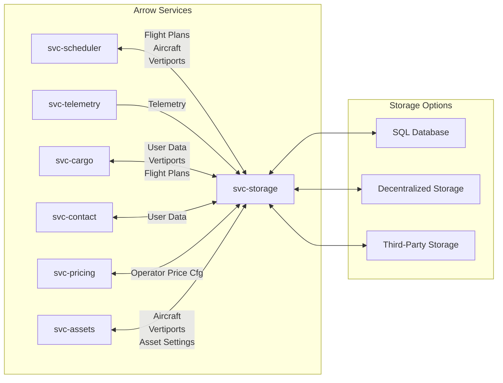
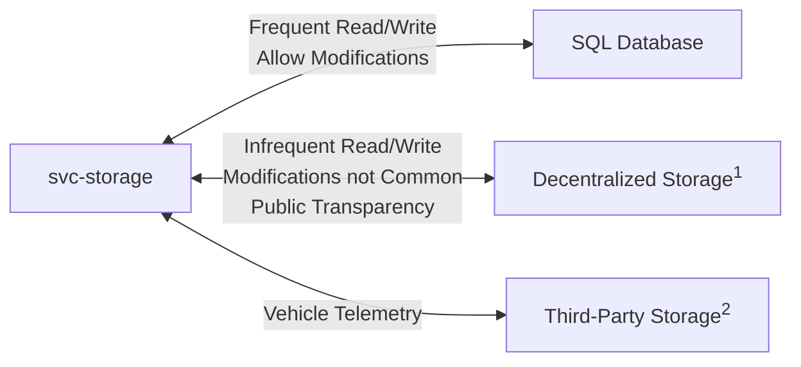

# Concept of Operations - `svc-storage`

Item | Value
--- | ---
Maintainer(s) | @arrow-air/services
Stuckee | Owlot ([@owlot](https://github.com/owlot))

:exclamation: This document is intended for internal use.

:exclamation: This document describes both current and *planned* capabilities. Not all features described in this document have been implemented.

## 1.0 Project Description

#### 1.0.1 Background

The Arrow network is data-driven. Safe aircraft operations rely on up-to-date information about vertiports, aircraft, users, flight plans, personnel, maintenance, telemetry, and more. This data must be stored securely and retrieved rapidly.

#### 1.0.2 Overview

1. `svc-scheduler` needs vertiport, flight plan, and aircraft information.
2. `svc-telemetry` needs to store a stream of telemetry data from each vehicle.
3. `svc-cargo` needs to request flight plans, vertiports, and user data.
4. `svc-contact` needs user information.
5. `svc-pricing` needs asset-owner settings for pricing vertipad occupation and cost per kWh.
6. `svc-assets` needs to store and retrieve settings, vertiports, and aircraft associated with an asset owner (carrier/operator).

## 2.0 Documents
### 2.1 Applicable Resources

Document | Description
--- | ---
| [High-Level Concept of Operations (CONOPS)](https://github.com/Arrow-air/se-services/blob/develop/docs/conops.md) | Overview of Arrow microservices.                             |
| [High-Level Interface Control Document (ICD)](https://github.com/Arrow-air/se-services/blob/develop/docs/icd.md)  | Interfaces and frameworks common to all Arrow microservices. |
[Software Design Document (SDD) - `svc-storage`](./sdd.md) | Defines the implementation of this interface.
[Interface Control Document (ICD) - `svc-storage`](./icd.md) | Defines the inputs and outputs of this microservice.
[Database Schemas](https://docs.google.com/spreadsheets/d/1tXZor-gYUSPWVfOg9e4GYx4ugVOIvuZZnjMUD5brWIQ/edit) | Defines the data types stored by `svc-storage`.

## 3.0 Description of Envisioned System

`svc-storage` is the only microservice directly contacting the database. It exposes an abstracted API for other services to write and read data. Decoupling the majority of microservices from the database has several key advantages:
1) If the database is migrated (e.g. from PostgreSQL to CockroachDB), the only microservice needing code updates would be `svc-storage`.
    - The general API that `svc-storage` exposes would not be changed, as it is not database-specific.
2) `svc-storage` is the singular authority to allow or block writes and reads.
3) `svc-storage` tightly controls the format and type of commands that can be made to the database.
    - Less opportunity for malformed SQL commands
4) `svc-storage` could theoretically return a record from cache
    - Immediately return a value to the requester without a database read
5) `svc-storage` can take responsibility for batching multiple writes on behalf of other microservices

## 3.1 Interfaces

A full description of interfaces for this module can be found in the [ICD](./icd.md).

## 3.2 Storage Options

Interfaces *between* services are not shown in these diagrams.

:exclamation: This is an *example* interface diagram. Some technologies have not yet been decided.

 

1 e.g. IPFS, Storj

2 Services like [Streamr](https://streamr.network/) offer a secure real-time data network for publishing and subscribing to telemetry streams.

## 4.0 Data Types

Data schemas have been defined [here](https://docs.google.com/spreadsheets/d/1tXZor-gYUSPWVfOg9e4GYx4ugVOIvuZZnjMUD5brWIQ/edit).

Each stored data type will have an associated:
- Visibility (public, private)
- Expiration/archive date

Both of these will vary by country/regulator.

Data types include:
- Vehicle Telemetry
- Maintenance Logs
- Service (Software) Logs
- Session Event Logs
- Vertipad Schedule
- Vertiport Log
- Personnel Certifications
- Personnel Contact Info
- Employment Info
- Component History
- Battery Telemetry
- Customer Contact Info

## 5.0 Physical Environment

See the High-Level Services CONOPS.

## 6.0 Support Environment

See the High-Level Services CONOPS.

## 7.0 Impact Considerations

See the High-Level Services CONOPS.

## 8.0 Risks and Potential Issues

***Attack Vector***

As a service in the core network, this service will be probed by malicious attacks of various forms. Intruders may attempt to imitate other services in the local network (such as `svc-cargo` or `svc-scheduler`) to send false data or overwhelm the network.

***Availability***

A failure of the service (power outage, process crash, server meltdown, etc.) could produce a situation where the storage service can't provide active flight plans or telemetry to external parties.

***Sensitive Data***

Users will request personal data through this service including ride history, vertiport defaults, and other sensitive information. Data traffic to and from this service should be encrypted for user privacy.

## 10.0.0 Security

`svc-storage` connects to the SQL database over TLS, requiring a valid certificate.

## Appendix A: Acronyms & Glossary

See the [Arrow Glossary](https://www.arrowair.com/docs/documentation/glossary).
