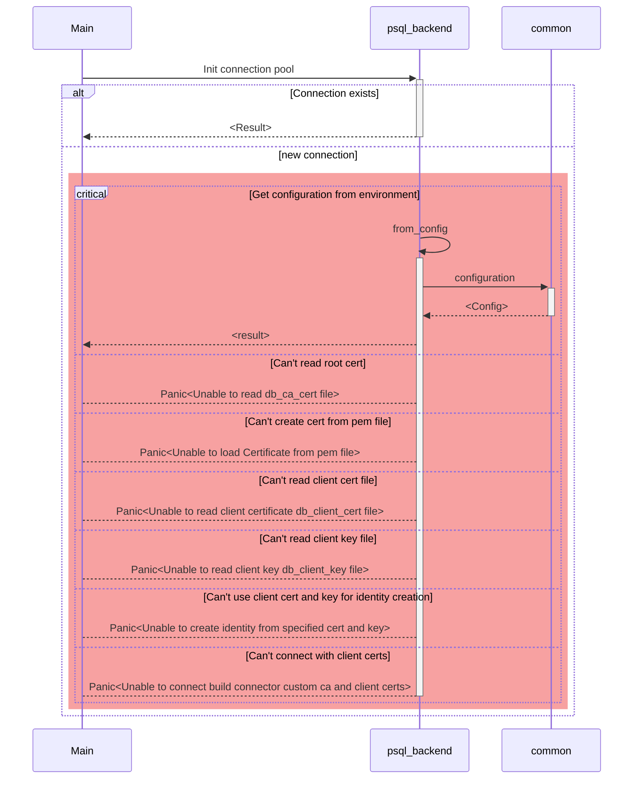
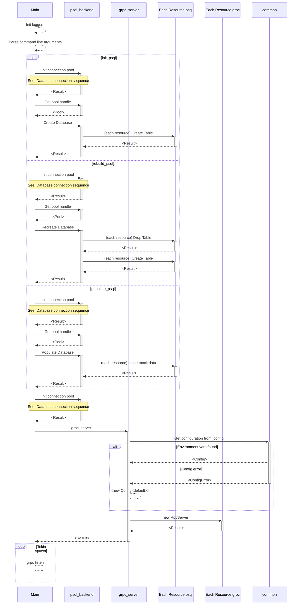
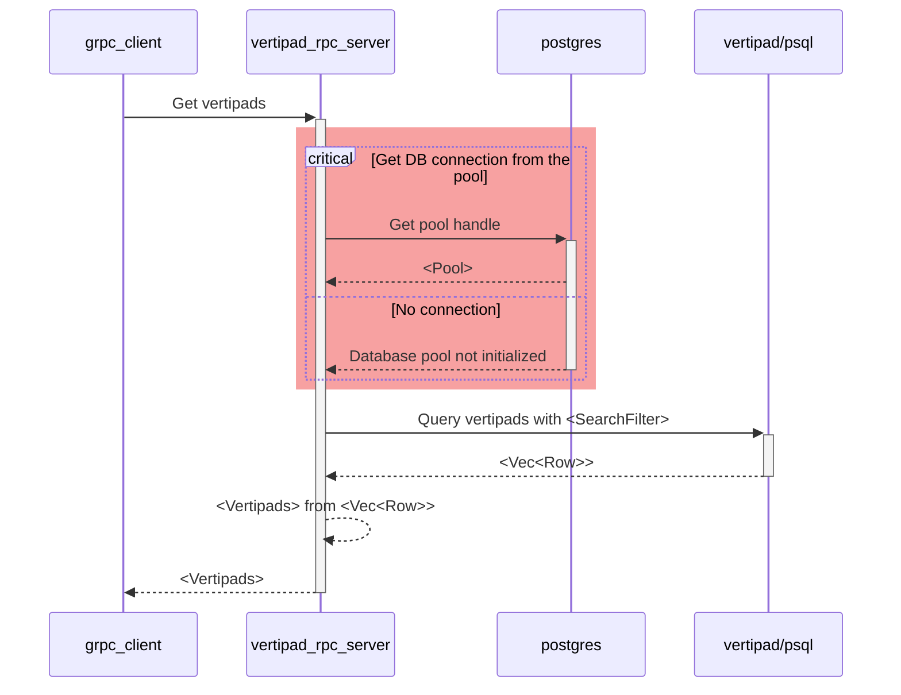
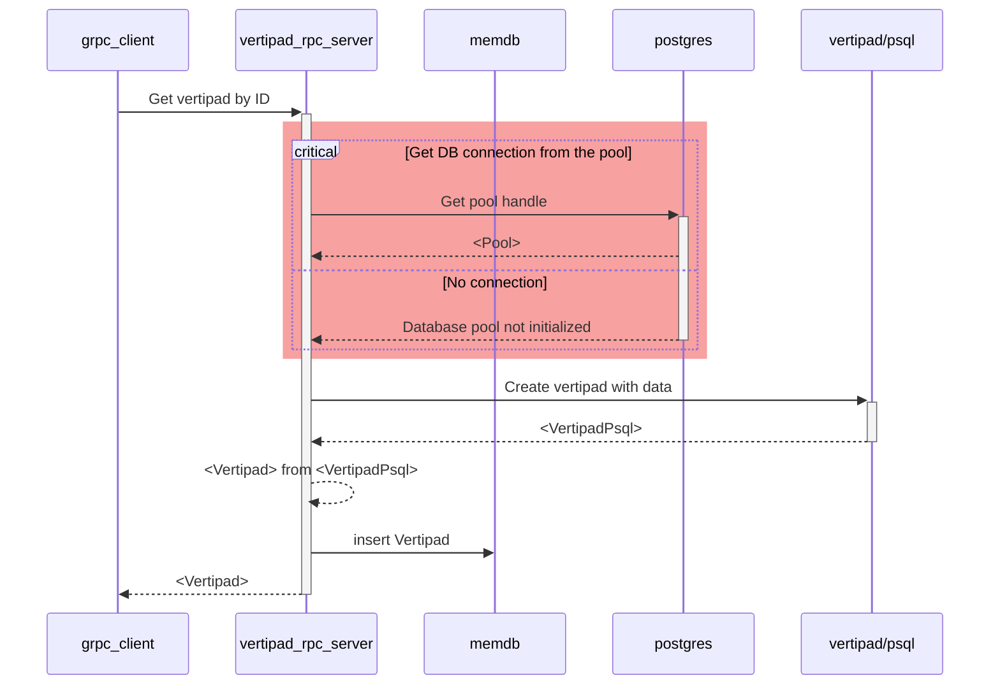
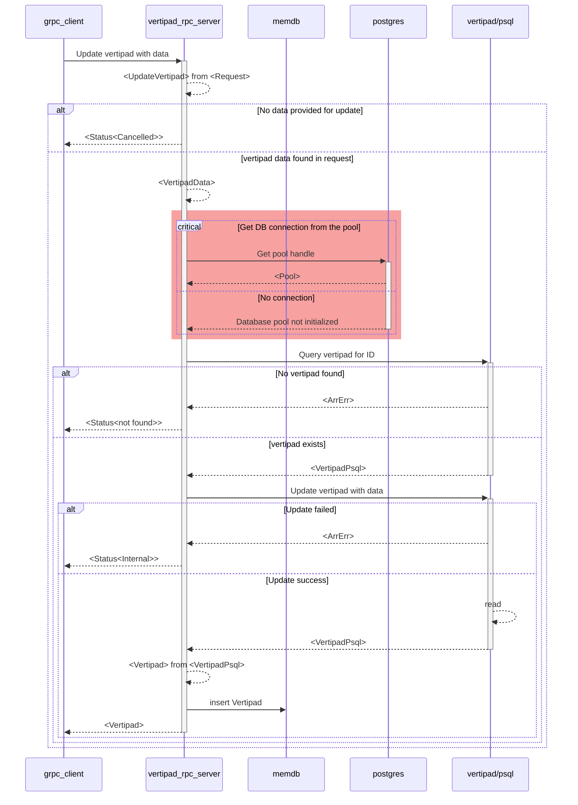
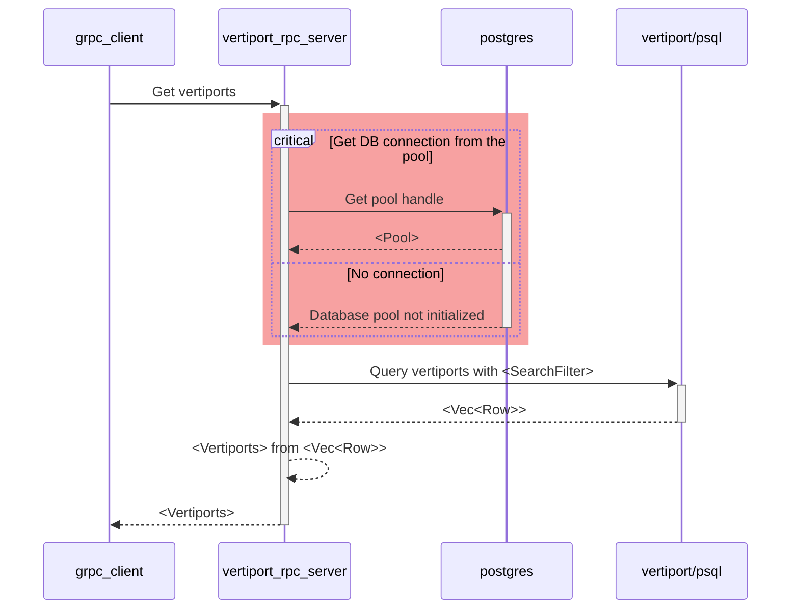
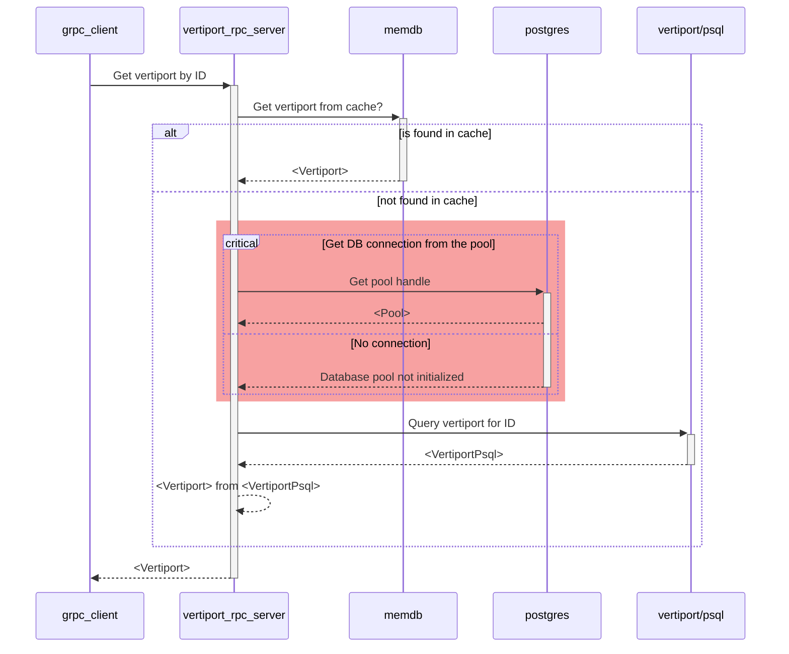
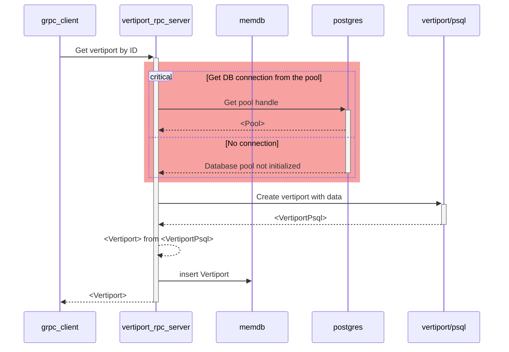
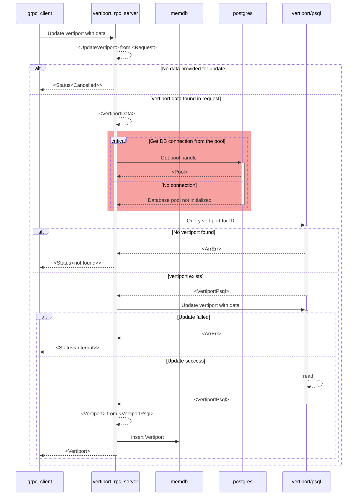
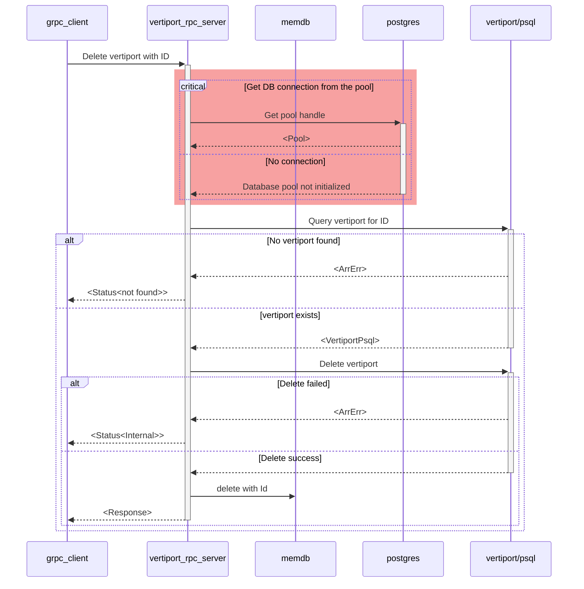

# `svc-storage` - Software Design Document (SDD)

## Overview

### Metadata

| Attribute     | Description                                                       |
| ------------- |-------------------------------------------------------------------|
| Maintainer(s) | [Services Team](https://github.com/orgs/Arrow-air/teams/services) |
| Stuckee       | Lotte ([@owlot](https://github.com/owlot))                        |
| Status        | Development                                                       |

This document details the software implementation of `svc-storage`.

This process is responsible for handling interactions with clients for data storage and retrieval.

*Note: This module is intended to be used by other Arrow micro-services via gRPC.*

*This document is under development as Arrow operates on a pre-revenue and pre-commercial stage. Storage requirements may evolve as per business needs, which may result in architectural/implementation changes to the storage module.*

## Related Documents

| Document                                                                                                          | Description
| ----------------------------------------------------------------------------------------------------------------- | ------------------------------------------------------------ |
| [High-Level Concept of Operations (CONOPS)](https://github.com/Arrow-air/se-services/blob/develop/docs/conops.md) | Overview of Arrow microservices.                             |
| [High-Level Interface Control Document (ICD)](https://github.com/Arrow-air/se-services/blob/develop/docs/icd.md)  | Interfaces and frameworks common to all Arrow microservices. |
| [Concept of Operations - `svc-storage`](./conops.md)                                                              | Defines the motivation and duties of this microservice.      |
| [Interface Control Document (ICD) - `svc-storage`](./icd.md)                                                      | Defines the inputs and outputs of this microservice.         |

## Frameworks

See the [High-Level Services ICD](https://github.com/Arrow-air/se-services/blob/develop/docs/icd.md).

## Location

Server-side service.

## Module Attributes

| Attribute       | Applies | Explanation                                                             |
| --------------- | ------- | ----------------------------------------------------------------------- |
| Safety Critical | No      | As of now, the storage service does not handle any safety critical data |
| Realtime        | No      | As of now, the storage service does not handle any realtime data        |

## Global Variables

None

## Logic 

### Initialization

At initialization this service creates a GRPC server for each resource module available.
In addition, it will create a connection to the backend database service (CockroachDB) and allocate internal memory HashMaps for each resource module for local caching purposes.

The GRPC server expects the following environment variables to be set:
- `DOCKER_PORT_GRPC` (default: `50051`)

### Control Loop

As a GRPC server, this service awaits requests and executes handlers.

All handlers **require** the following environment variables to be set:
- `PG__USER`
- `PG__DBNAME`
- `PG__HOST`
- `PG__PORT`
- `PG__SSLMODE`
- `DB_CA_CERT`
- `DB_CLIENT_CERT`
- `DB_CLIENT_KEY`

This information allows `svc-storage` to connect to the CockroachDB database backend.

:exclamation: These environment variables will *not* default to anything if not found. In this case, requests involving the handler will result in a server panic.

For detailed sequence diagrams regarding request handlers, see [GRPC Handlers](#grpc-handlers).

### Cleanup

None

## GRPC Handlers

See [the ICD](./icd.md) for this microservice.

### Storage Server

#### Database connection sequence

#### Server startup

### Vertipad

#### `vertipads`

#### `vertipad_by_id`

#### `insert_vertipad`

#### `update_vertipad`

#### `delete_vertipad`

### Vertiport

#### `vertiports`

#### `vertiport_by_id`

#### `insert_vertiport`

#### `update_vertiport`

#### `delete_vertiport`

