# Software Design Document (SDD) - `svc-storage`

## :telescope: Overview

This document details the software implementation of `svc-storage`.

This process is responsible for handling interactions with clients for data storage and retrieval.

*Note: This module is intended to be used by other Arrow micro-services via gRPC.*

*This document is under development as Arrow operates on a pre-revenue and
pre-commercial stage. Storage requirements may evolve as per business needs,
which may result in architectural/implementation changes to the storage module.*

### Metadata

| Attribute     | Description                                                       |
| ------------- |-------------------------------------------------------------------|
| Maintainer(s) | [Services Team](https://github.com/orgs/Arrow-air/teams/services) |
| Stuckee       | Lotte ([@owlot](https://github.com/owlot))                        |
| Status        | Development                                                       |

## :books: Related Documents

| Document                                                                                                          | Description
| ----------------------------------------------------------------------------------------------------------------- | ------------------------------------------------------------ |
| [High-Level Concept of Operations (CONOPS)](https://github.com/Arrow-air/se-services/blob/develop/docs/conops.md) | Overview of Arrow microservices. |
| [High-Level Interface Control Document (ICD)](https://github.com/Arrow-air/se-services/blob/develop/docs/icd.md)  | Interfaces and frameworks common to all Arrow microservices. |
| [Requirements - `svc-storage`](https://nocodb.arrowair.com/dashboard/#/nc/p_uyeuw6scqlnpri/table/L4/svc-storage)  | Requirements and user stories for this microservice. |
| [Concept of Operations - `svc-storage`](./conops.md)                                                              | Defines the motivation and duties of this microservice. |
| [Interface Control Document (ICD) - `svc-storage`](./icd.md)                                                      | Defines the inputs and outputs of this microservice. |

## :dna: Module Attributes

| Attribute       | Applies | Explanation                                                             |
| --------------- | ------- | ----------------------------------------------------------------------- |
| Safety Critical | No      | As of now, the storage service does not handle any safety critical data |
| Realtime        | No      | As of now, the storage service does not handle any realtime data        |

## :globe_with_meridians: Global Variables

None

## :gear: Logic

### Initialization

At initialization this service creates a GRPC server for each available resource module.
In addition, it will create a connection to the backend database service (CockroachDB).

The GRPC server expects the following environment variables to be set:
- `DOCKER_PORT_GRPC` (default: `50051`)

### Control Loop

As a GRPC server, this service awaits requests and executes handlers.

All handlers **require** the following environment variables to be set:
- `PG__USER`
- `PG__DBNAME`
- `PG__HOST`
- `PG__PORT`
- `PG__SSLMODE`
- `DB_CA_CERT`
- `DB_CLIENT_CERT`
- `DB_CLIENT_KEY`

This information allows `svc-storage` to connect to the CockroachDB database backend.

:exclamation: These environment variables will *not* default to anything if not found. In this case, requests involving the handler will result in a server panic.

For detailed sequence diagrams regarding request handlers, see [gRPC Handlers](#speech_balloon-grpc-handlers).

### Cleanup

None

## :speech_balloon: gRPC Handlers

See [the ICD](./icd.md) for this microservice.

### Storage Server

#### Database connection sequence
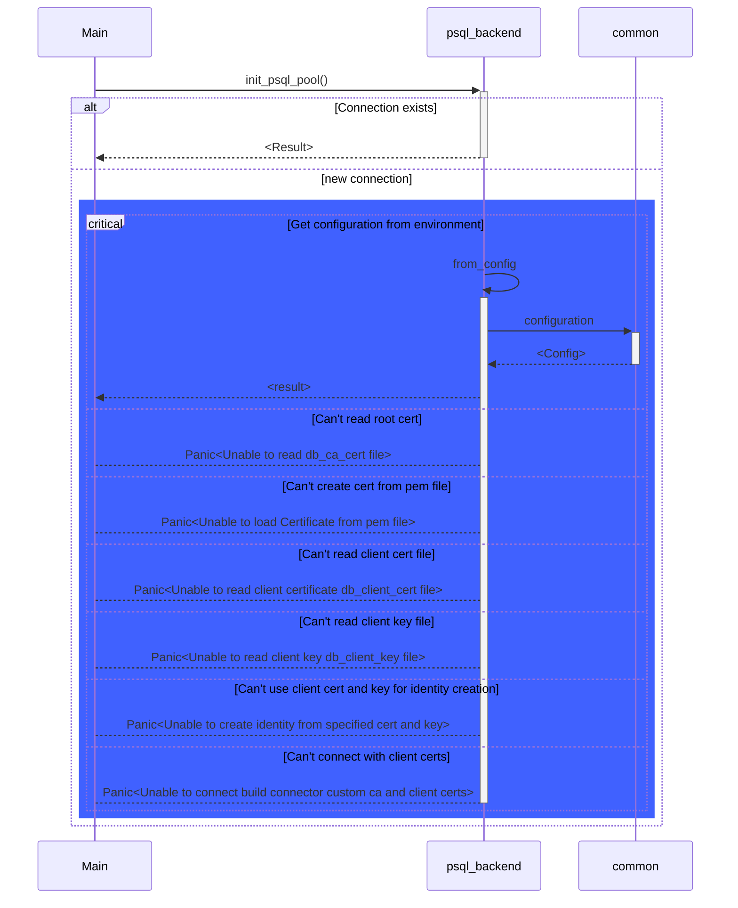

#### Server startup
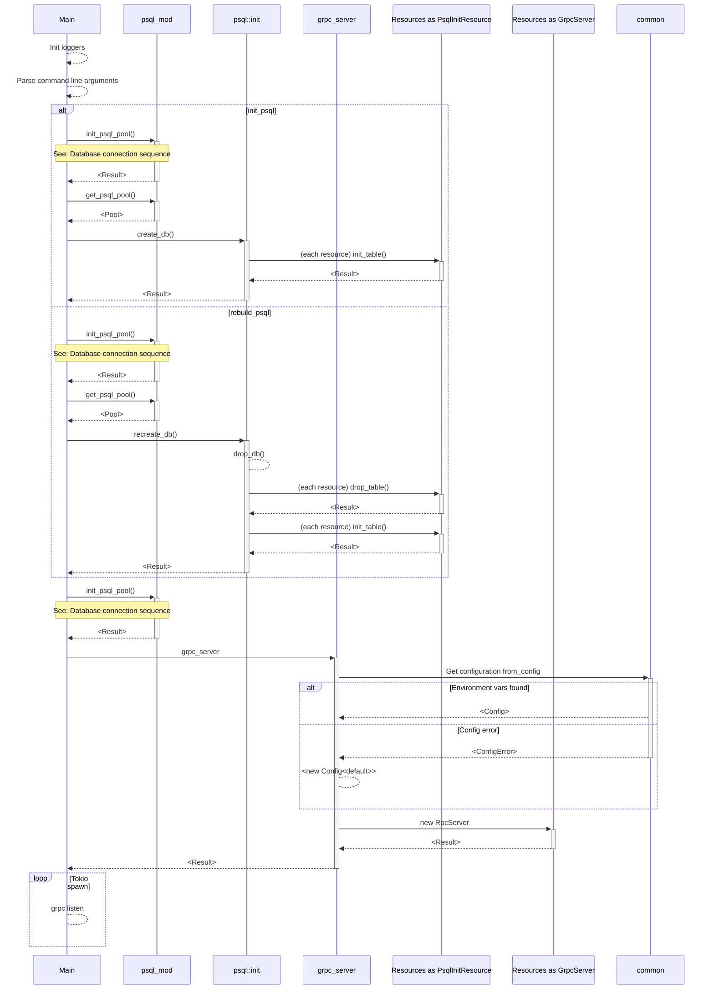

### Simple Resource

#### `get_by_id`
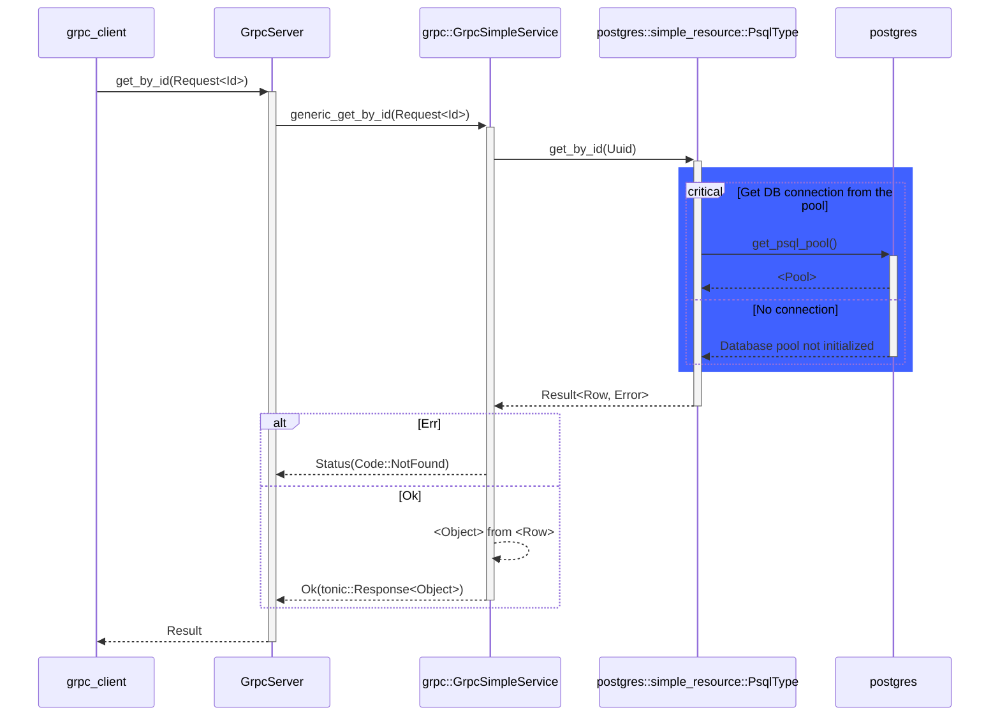

#### `search`
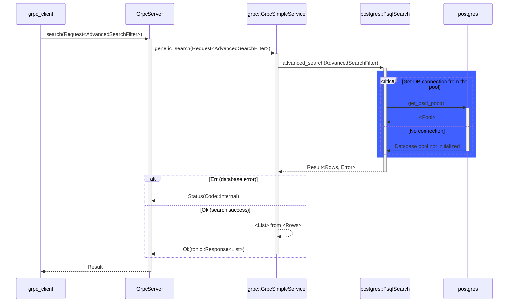

#### `insert`
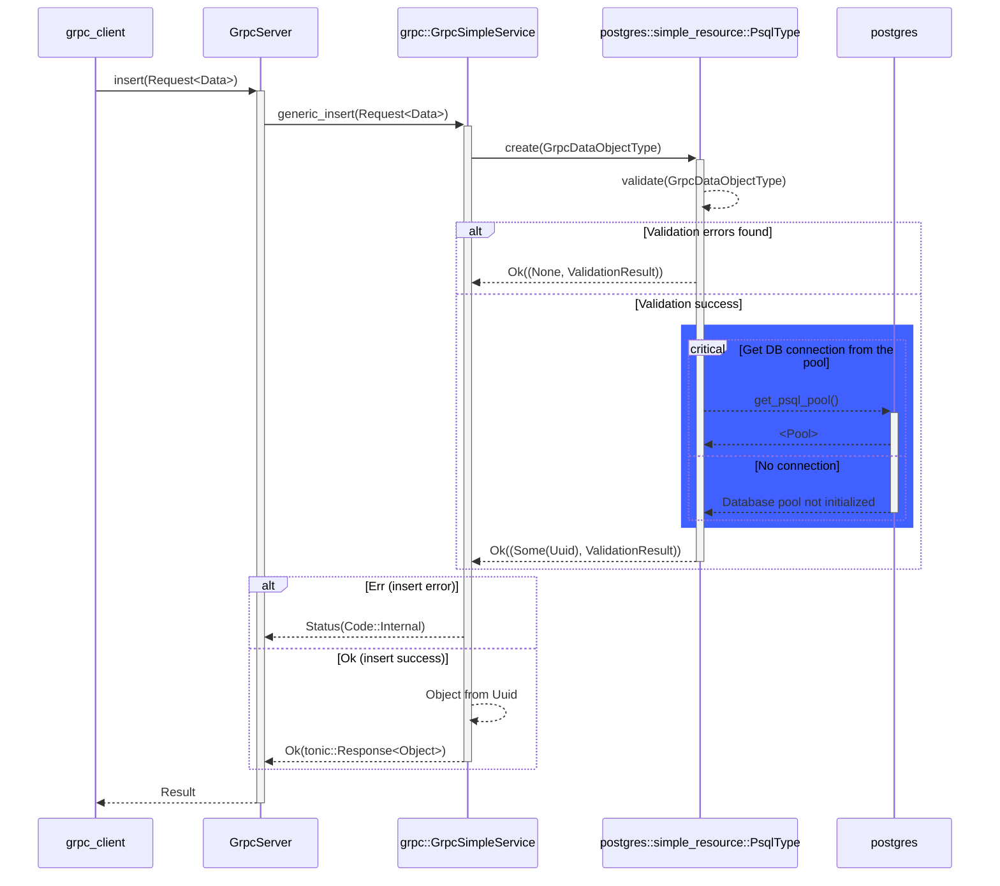

#### `update`
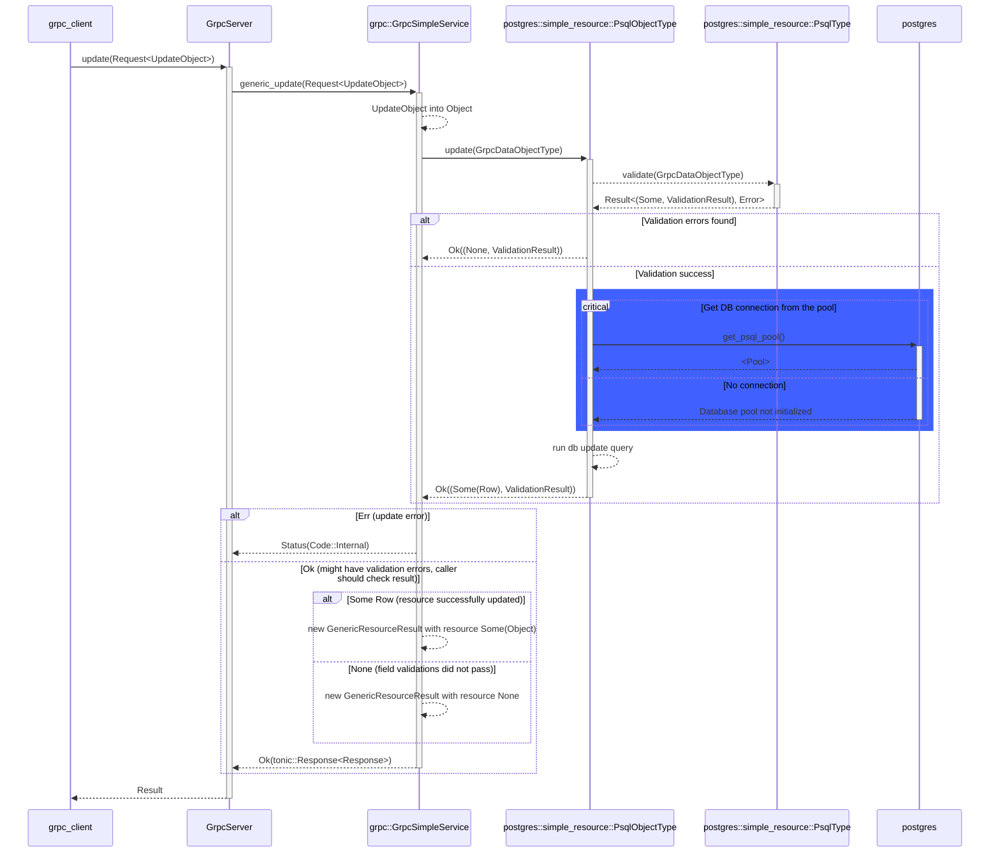

#### `delete`
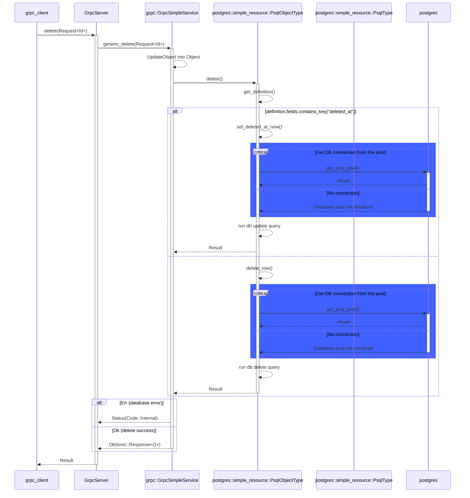

### linked Resource

#### `link`
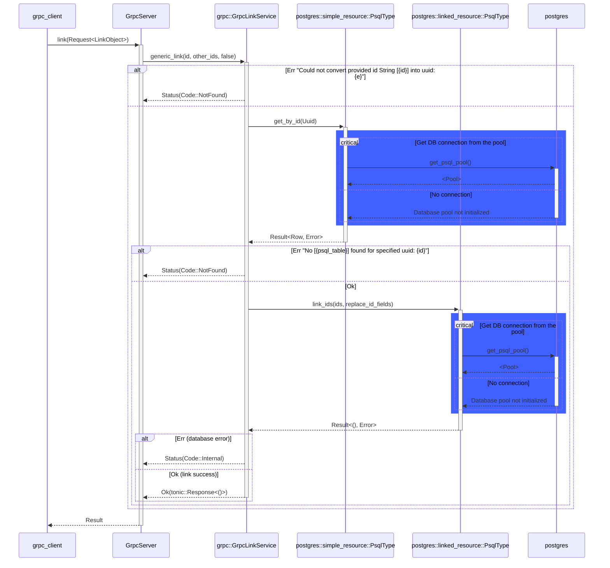

#### `replace_linked`
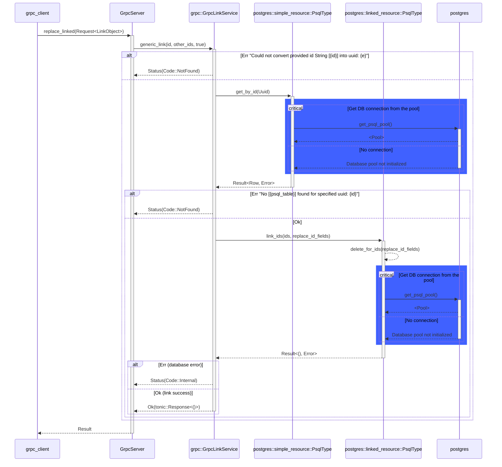

#### `unlink`
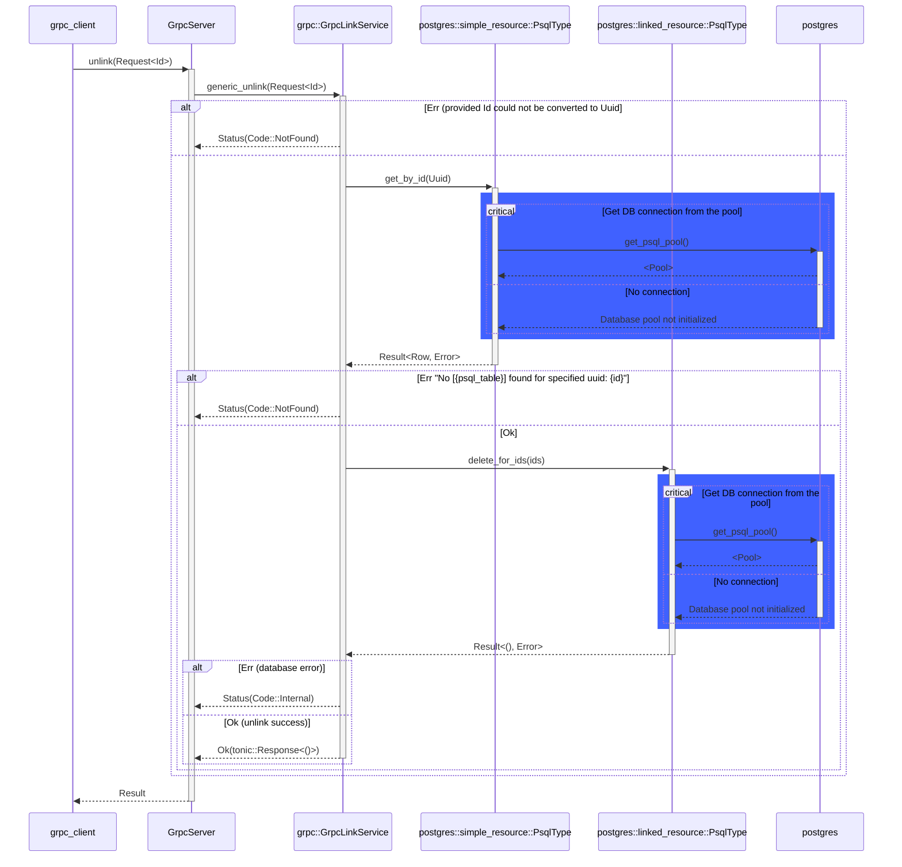

#### `get_linked_ids`
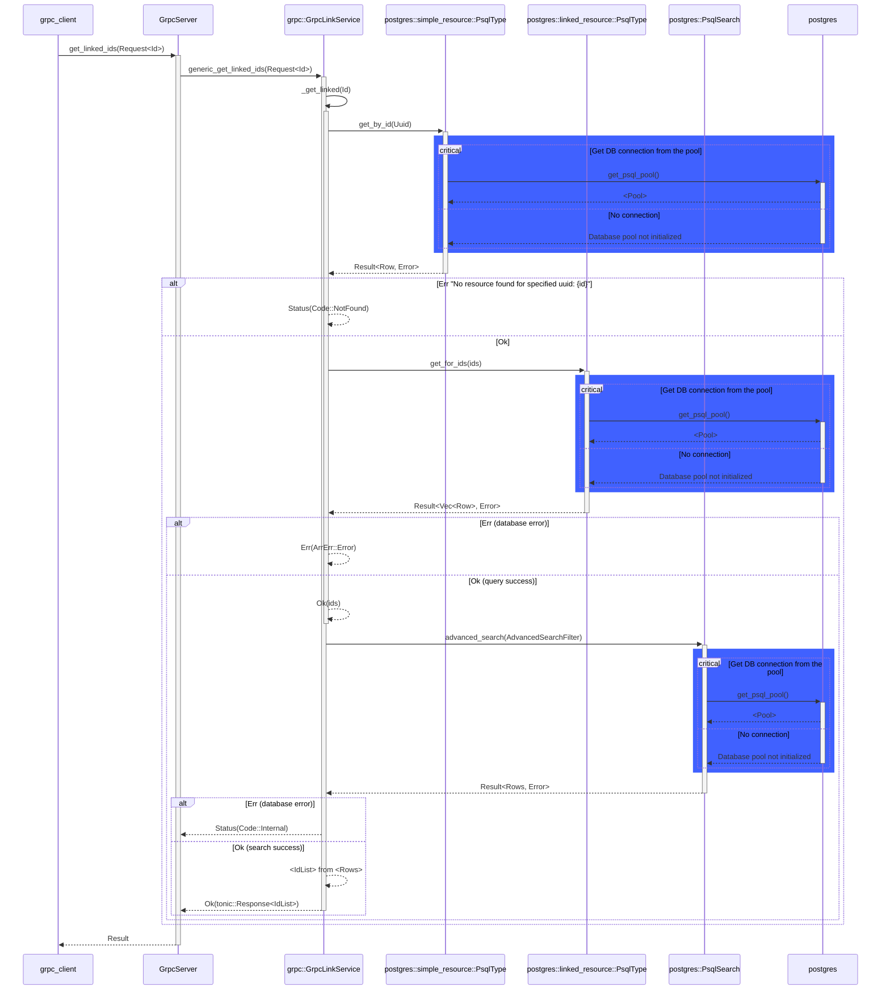

#### `get_linked`
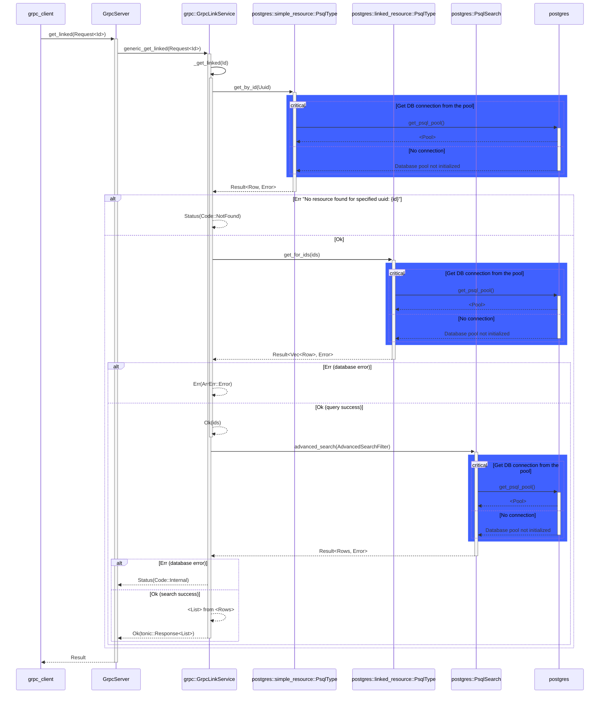

### Data model CockroachDB

| Value (left) | Value (right) | Meaning                       |
| ------------ | ------------- | ----------------------------- |
| \|o          | o\|           | Zero or one                   |
| \|\|         | \|\|          | Exactly one                   |
| }o           | o{            | Zero or more (no upper limit) |
| }\|          | \|{           | One or more (no upper limit)  |

```mermaid
erDiagram
    %field {
    %    serial field_id PK
    %    text field_name
    %    text field_type "string / int / bool / datetime / etc..."
    %    text re_validation "Optional - regex validation string"
    %    text validation_message "Optional"
    %}
    flight_plan {
        uuid flight_plan_id PK
        uuid pilot_id FK
        uuid vehicle_id FK
        json cargo_weight_grams
        geometry path "LINESTRING"
        text weather_conditions "Optional"
        uuid departure_vertipad_id FK
        uuid destination_vertipad_id FK
        timestamp scheduled_departure
        timestamp scheduled_arrival
        timestamp actual_departure "Optional"
        timestamp actual_arrival "Optional"
        timestamp flight_release_approval "Optional"
        timestamp flight_plan_submitted "Optional"
        uuid approved_by FK "Optional"
        text flight_status "Default DRAFT"
        text flight_priority "Default LOW"
        timestamp created_at "Default NOW"
        timestamp updated_at "Default NOW"
        timestamp deleted_at "Optional Default NULL"
    }
    itinerary {
        uuid itinerary_id PK
        uuid user_id
        text status "Default ACTIVE"
    }
    itinerary_flight_plan {
        combined itinerary_id_flight_plan_id PK
        uuid itinerary_id FK
        uuid flight_plan_id FK
    }
    vertiport {
        uuid vertiport_id PK
        text name
        text description
        geometry geo_location "POLYGON"
        text schedule
        timestamp created_at "Default NOW"
        timestamp updated_at "Default NOW"
        timestamp deleted_at "Optional Default NULL"
    }
    vertipad {
        uuid vertipad_id PK
        uuid vertiport_id FK
        text name
        geometry geo_location "POINT"
        text schedule
        bool enabled "Default true"
        bool occupied "Default false"
        timestamp created_at "Default NOW"
        timestamp updated_at "Default NOW"
        timestamp deleted_at "Optional Default NULL"
    }
    pilot {
        uuid pilot_id PK
        text first_name
        text last_name
        timestamp created_at "Default NOW"
        timestamp updated_at "Default NOW"
        timestamp deleted_at "Optional Default NULL"
    }
    vehicle {
        uuid vehicle_id PK
        uuid vehicle_model_id
        text serial_number
        text registration_number
        text description "Optional"
        uuid asset_group_id "Optional"
        text schedule "Optional"
        timestamp last_maintenance "Optional"
        timestamp next_maintenance "Optional"
        uuid last_vertiport_id FK "Optional"
        timestamp created_at "Default NOW"
        timestamp updated_at "Default NOW"
        timestamp deleted_at "Optional Default NULL"
    }
    scanner {
        uuid scanner_id PK
        uuid organization_id
        text scanner_type "ENUM(MOBILE,LOCKER,FACILITY,UNDERBELLY)"
        text scanner_status "ENUM(ACTIVE,DISABLED)"
        timestamp created_at "Default NOW"
        timestamp updated_at "Default NOW"
        timestamp deleted_at "Optional Default NULL"
    }
    parcel {
        uuid parcel_id PK
        uuid itinerary_id FK
        text status "ENUM(NOTDROPPEDOFF,DROPPEDOFF,ENROUTE,ARRIVED,PICKEDUP,COMPLETE)"
        timestamp created_at "Default NOW"
        timestamp updated_at "Default NOW"
        timestamp deleted_at "Optional Default NULL"
    }
    parcel_scan {
        uuid parcel_id FK
        uuid scanner_id FK
        geometry geo_location "POINT"
        timestamp created_at "Default NOW"
        timestamp updated_at "Default NOW"
        timestamp deleted_at "Optional Default NULL"
    }
    user {
        uuid user_id PK
        text auth_method "ENUM (OAUTH_GOOGLE,OAUTH_FACEBOOK,OAUTH_AZURE_AD,LOCAL)"
        text display_name
        timestamp created_at "Default NOW"
        timestamp updated_at "Default NOW"
        timestamp deleted_at "Optional Default NULL"
    }
    %user_field {
    %    serial user_field_id PK
    %    serial field_id FK
    %    bool is_mandatory "Default false"
    %    text category "ENUM (additional_info, settings)"
    %}
    %user_field_value {
    %    serial user_field_id PK
    %    uuid user_id PK
    %    text value
    %    timestamp updated_at "Default NOW"
    %}
    group {
        uuid group_id PK
        text name
        text description
        uuid parent_group_id FK "Optional"
        timestamp created_at "Default NOW"
        timestamp updated_at "Default NOW"
        timestamp deleted_at "Optional Default NULL"
    }
    user_group {
        uuid user_id FK
        uuid group_id FK
    }

    %field }o--o{ user_field : field_id
    %user_field }o--o{ user_field_value : user_field_id
    %user }o--|| user_field_value : user_id

    user }o--o{ user_group : user_id
    group }o--o{ user_group : group_id

    flight_plan }o--|| vertipad : departure_vertipad_id
    flight_plan }o--|| vertipad : destination_vertipad_id
    flight_plan }o--|| pilot : pilot_id
    flight_plan }o--|| vehicle : vehicle_id

    itinerary_flight_plan |o--|{ flight_plan : flight_plan_id
    itinerary_flight_plan |o--|| itinerary : itinerary_id

    vertipad }o--|| vertiport : vertiport_id

    parcel }o--o{ parcel_scan : parcel_id
    parcel }o--o{ itinerary : itinerary_id
    scanner }o--o{ parcel_scan : scanner_id
```
