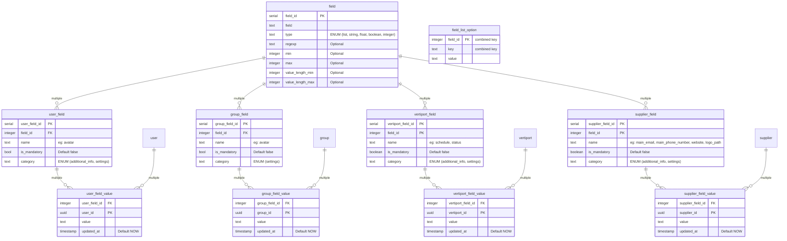

# Software Design Document (SDD) - `svc-storage`

## :telescope: Overview

This document details the software implementation of `svc-storage`.

This process is responsible for handling interactions with clients for data storage and retrieval.

*Note: This module is intended to be used by other Aetheric micro-services via gRPC.*

*This document is under development as Aetheric operates on a pre-revenue and
pre-commercial stage. Storage requirements may evolve as per business needs,
which may result in architectural/implementation changes to the storage module.*

### Metadata

| Attribute     | Description                                                                    |
| ------------- |--------------------------------------------------------------------------------|
| Maintainer(s) | [@aetheric-oss/dev-realm](https://github.com/orgs/aetheric-oss/teams/dev-realm)|
| Stuckee       | Lotte ([@owlot](https://github.com/owlot))                                     |
| Status        | Development                                                                    |

## :books: Related Documents

| Document                                                                                                             | Description
| -------------------------------------------------------------------------------------------------------------------- | ------------------------------------------------------------ |
| [High-Level Concept of Operations (CONOPS)](https://github.com/aetheric-oss/se-services/blob/develop/docs/conops.md) | Overview of Realm microservices.                             |
| [High-Level Interface Control Document (ICD)](https://github.com/aetheric-oss/se-services/blob/develop/docs/icd.md)  | Interfaces and frameworks common to all Realm microservices. |
| [Requirements - `svc-storage`](https://nocodb.aetheric.nl/dashboard/#/nc/p_uyeuw6scqlnpri/table/L4/svc-storage)      | Requirements and user stories for this microservice.         |
| [Concept of Operations - `svc-storage`](./conops.md)                                                                 | Defines the motivation and duties of this microservice.      |
| [Interface Control Document (ICD) - `svc-storage`](./icd.md)                                                         | Defines the inputs and outputs of this microservice.         |

## :dna: Module Attributes

| Attribute       | Applies | Explanation                                                             |
| --------------- | ------- | ----------------------------------------------------------------------- |
| Safety Critical | No      | As of now, the storage service does not handle any safety critical data |
| Realtime        | No      | As of now, the storage service does not handle any realtime data        |

## :globe_with_meridians: Global Variables

None

## :gear: Logic

### Initialization

At initialization this service creates a GRPC server for each available resource module.
In addition, it will create a connection to the backend database service (CockroachDB).

The GRPC server expects the following environment variables to be set:
- `DOCKER_PORT_GRPC` (default: `50051`)

### Control Loop

As a GRPC server, this service awaits requests and executes handlers.

All handlers **require** the following environment variables to be set:
- `PG__USER`
- `PG__DBNAME`
- `PG__HOST`
- `PG__PORT`
- `PG__SSLMODE`
- `DB_CA_CERT`
- `DB_CLIENT_CERT`
- `DB_CLIENT_KEY`

This information allows `svc-storage` to connect to the CockroachDB database backend.

:exclamation: These environment variables will *not* default to anything if not found. In this case, requests involving the handler will result in a server panic.

For detailed sequence diagrams regarding request handlers, see [gRPC Handlers](#speech_balloon-grpc-handlers).

### Cleanup

None

## :speech_balloon: gRPC Handlers

See [the ICD](./icd.md) for this microservice.

### Storage Server

#### Database connection sequence

#### Server startup

### Simple Resource

#### `get_by_id`

#### `search`

#### `insert`

#### `update`

#### `delete`

### linked Resource

#### `link`

#### `replace_linked`

#### `unlink`

#### `get_linked_ids`

#### `get_linked`

## Data model CockroachDB

| Value (left) | Value (right) | Meaning                       |
| ------------ | ------------- | ----------------------------- |
| \|o          | o\|           | Zero or one                   |
| \|\|         | \|\|          | Exactly one                   |
| }o           | o{            | Zero or more (no upper limit) |
| }\|          | \|{           | One or more (no upper limit)  |

### Itinerary and Flight Plan schema

### Parcel schema

### Group schema for users and assets

Groups can have multiple functions:
 - providing a way to organize
 - assign ACLs to a group of users
 - provide default settings 

To distinguish the group's purpose, each group has a group `type`:
 - `acl` - The group can be linked to the `group_acl` table.
 - `settings` - The group can be linked to the `group_field_value` table.
 - `display` - The group is only used to allow for an organized view in the frontend.

#### Example data

**groups**

| group_id | name           | description                                    | type     | parent_group_id |
|----------|----------------|------------------------------------------------|----------|-----------------|
| group_1  | Countries      | Parent group for country specific settings     | settings | NULL            |
| group_2  | Assets NL      | Default settings for assets in The Netherlands | settings | group_1         |
| group_3  | Assets US      | Default settings for assets in the US          | settings | group_1         |
| group_4  | Assets US TX   | Default settings for assets in US Texas        | settings | group_3         |
| group_5  | Assets US WA   | Default settings for assets in US Texas        | settings | group_3         |
| group_6  | Assets US CA   | Default settings for assets in US Texas        | settings | group_3         |
| group_8  | Supplier 1     | Parent group for Supplier 1                    | display  | NULL            |
| group_9  | Favorites      | My favorite assets                             | display  | group_8         |
| group_10 | Administrator  | Group for users with administrator privileges  | acl      | group_8         |
| group_11 | Asset manager  | Group for users with asset manager privileges  | acl      | group_8         |
| group_12 | Super Admin    | Group for users with super admin privileges    | acl      | NULL            |
| group_13 | Supplier Admin | Group for users with supplier admin privileges | acl      | NULL            |

**users**
| user_id | display_name | email |
|---------|--------------| ----- |
| user_1  | Thomasg      | thomasg@arrowair.com |
| user_2  | A.M. Smith   | amsmith@aetheric.nl |
| user_3  | MissQueen    | missqueen@aetheric.nl |
| user_4  | Owlot        | owlot@aetheric.nl | 

**vehicles**
| vehicle_id | vehicle_model | description                |
|------------|---------------|----------------------------|
| vehicle_1  | FEATHER1      | First Project Feather VTOL |

**asset suppliers**
| supplier_id | name  |
|-------------------|-------|
| supplier_1  | Arrow |
| supplier_2  | Aetheric |

**acl**
| acl_id  | code            | description                |
|---------|-----------------|----------------------------|
| acl_0   | SUPERUSER       | All permissions            |
| acl_1   | ASSET_CREATE    | Create new assets          |
| acl_2   | ASSET_EDIT      | Edit existing assets       |
| acl_3   | ASSET_DELETE    | Delete assets              |
| acl_4   | ASSET_VIEW      | View assets                |
| acl_5   | USER_CREATE     | Create new users           |
| acl_6   | USER_EDIT       | Edit existing users        |
| acl_7   | USER_DELETE     | Delete users               |
| acl_8   | USER_VIEW       | View users                 |
| acl_9   | SUPPLIER_CREATE | Create new suppliers       |
| acl_10  | SUPPLIER_EDIT   | Edit existing supplier     |
| acl_11  | SUPPLIER_DELETE | Delete suppliers           |
| acl_12  | SUPPLIER_VIEW   | View suppliers             |

We can now have the groups linked as followed:

### Field schema for settings

Certain resources may possess settings that are not classified as properties defining the resource itself; instead, they are settings that can undergo frequent changes, possibly on a daily or even faster basis. These settings will be stored in a separate table to enhance caching mechanisms. This optimization will be applied at both the database engine level as within the Realm services responsible for offering and accessing these settings. A generic data model facilitates the straightforward management of these fields within both the code and the database itself.

The `field` table provides information about the type of field. This allows for proper input validation. If a field is of the `integer` type, a min and or max value can be configured. In addition, regular expressions can be defined to allow for specific input validation (eg; `email` or `postal codes` inputs). The `value_length_min` and `value_length_max` columns can be used to provide a minimum or maximum length of the input text.

Each resource will have a combined table, defining the fields that are linked to the resource. Additionally, a `category` can be provided, allowing grouping of settings which can be used in a frontend view.

